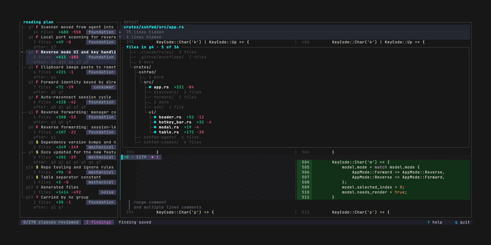

```
       ___ ________                     __  _       __
  ____/ (_) __/ __/__  ________  ____  / /_(_)___ _/ /
 / __  / / /_/ /_/ _ \/ ___/ _ \/ __ \/ __/ / __ `/ /
/ /_/ / / __/ __/  __/ /  /  __/ / / / /_/ / /_/ / /
\__,_/_/_/ /_/  \___/_/   \___/_/ /_/\__/_/\__,_/_/
```

# differential

**Read a large diff as an ordered plan, not as a wall of files.**

`differential` takes a big merge request and sorts it. It finds the changes that are the
same edit repeated. It finds the generated noise. It finds the few changes that need
careful reading. Then it gives you a reading plan in the order you should read it.

Every hunk is accounted for. Nothing is filtered out, ever. So skipping what the plan
says to skip is safe.



*`dfr review` on a 278-class branch. The plan is on the left, the diff on the right, and the float maps the selected group across the file tree.*

## Why the name

> A differential is a gear system in vehicles that lets driven wheels rotate at different
> speeds while still receiving power from the engine.

That is the idea, and the word already contains "diff". Each group of changes turns at
its own reading speed. Every hunk still gets power.

## The problem

A 100-file merge request is not 100 files of work. Most of it is one decision echoing
through the codebase. A signature change cascades through call sites. A rename sweeps
across imports. A lockfile regenerates itself. Your real job is to find the few changes
that deserve attention, and to skip the rest safely.

## How it works

The pipeline has four stages.

1. **Enumerate.** Read every hunk from `git diff -U0 --no-renames`. No file is skipped.
   No extension is filtered. Config cannot change this.
2. **Classify.** Give each hunk a **shape class**. A shape class is a hash of the hunk's
   diff text after identifiers and literals are normalised away, on both the removed and
   the added side. Two hunks in one class are the same edit wearing different names.
   Classes are named `C0`, `C1`, and so on, largest first.
3. **Group.** An LLM merges and labels **class ids**. It never sees or names a hunk. So
   it cannot drop one. If it omits a class id, an audit catches that and back-fills the
   class into a must-read group.
4. **Order.** Build a dependency graph from symbol definitions to symbol uses. Sort the
   focus groups foundation-first. You meet an abstraction before you meet its callers.

### The three tiers

Every group gets one tier.

| tier | what you do |
|---|---|
| `focus` | Read every hunk, line by line. |
| `skim` | Read one example per shape class. Trust the rest. |
| `noise` | Generated content. Fold it. Read nothing. |

A fourth label appears in the output: `unclassified`. That is the back-fill group. The
model never named those classes, so nothing judged them. You must read them.

### The saving is reported honestly

Skim exemplars still get read. So a skim total is not time saved. Every document reports
two numbers separately:

- `read_hunks` — focus hunks, plus one exemplar per skim class.
- `skipped_hunks` — skim remainders, plus folded noise.

Only `skipped_hunks` is the genuine saving.

## Requirements

- `git` on your PATH. All repository access shells out to real git.
- An LLM CLI for the grouping stage. The default is
  [`claude`](https://claude.com/claude-code), run headless with tools denied. Any command
  that takes a prompt on stdin and writes text on stdout works. See [Config](#config).
- Rust stable to build from source. The version is pinned in `rust-toolchain.toml`.

## Install

```sh
cargo install differential
```

That installs two binaries, `dfr` and `differential`. They are the same program.

## Quick start

```sh
cd your-repo
dfr review main..feature
```

That opens the terminal reviewer. Two panes: the reading plan on the left, the diff on the
right.

The first run on a range calls the LLM once. On a big merge request that takes a minute or
two. A splash screen shows the stages while you wait. The result is then cached, so later
runs are instant and stable.

Work down the plan from the top. `tab` switches panes. `j` and `k` move. `space` marks a
hunk's shape class reviewed, so one exemplar clears the whole class. `c` writes a finding
against the line under the cursor, and `F` lists every finding you have written. `y` copies
them all to the clipboard as markdown. `?` shows every key. `q` quits, and nothing is lost —
state is saved as you go.

Run it with no range at all:

```sh
dfr review
```

That opens a picker. Choose the base commit, and tick the box to include your uncommitted
work. So "everything since `main`, including what I have not committed" is one choice.

Full detail, and every key: [`crates/tui/README.md`](crates/tui/README.md).

### Or read it as a commit stack

If you would rather stay in your IDE, in `tig`, or in plain `git log`, render the same plan
as a stack of synthetic commits:

```sh
dfr stack main..feature
```

```
refs/review/1a2b3c4-5d6e7f8/stack  (14 commits, 187 hunks, recount 187)
  ...
review with: git log --oneline 1a2b3c4d5e6f..refs/review/1a2b3c4-5d6e7f8/stack
```

Now read the stack like any branch:

```
$ git log --oneline 1a2b3c4d5e6f..refs/review/1a2b3c4-5d6e7f8/stack
f00dfee  [unclassified] 1 hunks carried by no group
0ddba11  [noise] Lockfiles and generated artefacts — folded, 21 hunks
cafe007  [skim 2/2] Import swaps for the renamed module — 38 further hunks, same shapes
beefed5  [skim 1/2] Import swaps for the renamed module — 28 exemplars
add1c7e  [focus] Rework retry handling in the client
decade0  [focus] Introduce the storage backend trait and its implementations
```

Read from the bottom up. Read the `[focus]` commits first. Definitions come before their
callers. Then read one exemplar per shape in `[skim 1/2]`. Then skip `[skim 2/2]` and
`[noise]` on their subject lines alone. Every hunk in them repeats a shape you already
checked.

The stack never touches your worktree, your index, or your branches. It is built with git
plumbing and lands one ref.

Full detail: [`crates/stack/README.md`](crates/stack/README.md).

## Commands

| command | what it does |
|---|---|
| `dfr review [<range>]` | Open the terminal reviewer. With no range it opens a picker. |
| `dfr stack <range>` | Build the review commit stack and land it on a ref. |
| `dfr check <range>` | Run the structural invariants. Use this in CI. |
| `dfr findings <range>` | Print the review's findings as JSON. |

Every command takes `--repo`, `--config` and `--user-config`. Exit codes: `0` success,
`1` invariant or pipeline failure, `2` usage or config error.

Full reference, including every flag and every key in the reviewer:
[`crates/cli/README.md`](crates/cli/README.md).

## Using it as a library

The engine is a library first. The JSON plan document it produces is the contract that
every renderer reads.

```rust
use differential_engine::{gitio::Repo, config::Config, lang::LanguageRegistry,
                          store::OsConfigSource, resolve_range, run_pipeline};

let repo = Repo::open(path)?;
let config = Config::load(&OsConfigSource, repo.root(), None, None)?;
let src = resolve_range(&repo, &["main..feature"])?;   // a ReviewSource
let out = run_pipeline(&repo, &src.base, &src.head, src.kind, &config,
                       &LanguageRegistry::builtin())?;
// out.report   — the invariant report, always present
// out.document — Some(PlanDocument), or None if an invariant failed
```

Full surface: [`crates/engine/README.md`](crates/engine/README.md) and
[`spec/consumers.md`](spec/consumers.md).

## Config

Config is optional. Two files exist, split by who owns the setting.

**Repo file** — `.differential.toml` at the repository root. Classification hints only.
Everyone reviewing the repo shares them.

```toml
[classify]
# Extra globs to mark as generated. Generated files fold as noise.
generated = ["**/__snapshots__/**", "migrations/**"]
# Never mark these generated. This wins over everything else.
not_generated = ["important.lock"]
# gitattributes names honoured as a "generated" declaration.
attributes = ["linguist-generated"]
```

| key | default | meaning |
|---|---|---|
| `classify.generated` | `[]` | Globs that mark a file as generated. |
| `classify.not_generated` | `[]` | Globs that never mark a file as generated. |
| `classify.attributes` | `["linguist-generated"]` | gitattributes names read as "generated". |

**User file** — `~/.config/differential/config.toml`. It honours `XDG_CONFIG_HOME`. Which
agent to run is your choice, not the repo's. So is how much of a file the reviewer shows.

```toml
[grouping]
# Any command: prompt on stdin, text on stdout. The default is shown.
command = ["claude", "-p", "--output-format", "text", "--allowed-tools", ""]
timeout_secs = 1200

[review]
# Context lines shown either side of a hunk in `dfr review`.
context = 3
# Lines that one `z` pulls in at a context boundary.
context_step = 10
```

| key | default | meaning |
|---|---|---|
| `grouping.command` | the `claude` line above | The grouping backend, as an argv list. |
| `grouping.timeout_secs` | `1200` | How long to wait for the backend. |
| `review.context` | `3` | Context lines around a hunk before any expansion. |
| `review.context_step` | `10` | Lines one `z` pulls in at a boundary row. |

A missing file means defaults. A malformed file is a hard error. An unknown key is a hard
error too.

**The one rule config can never break: config never removes a file or a hunk from
analysis.** It tunes classification hints and tool behaviour only. Every invariant depends
on that.

## The crates

| crate | what it is |
|---|---|
| [`differential`](crates/cli/README.md) | The application. It owns the `dfr` and `differential` binaries. |
| [`differential-engine`](crates/engine/README.md) | The core library: git io, diff parsing, shape classes, grouping, ordering, invariants. |
| [`differential-stack`](crates/stack/README.md) | The shadow-branch renderer. The diff as a synthetic commit stack. |
| [`differential-tui`](crates/tui/README.md) | The terminal reviewer behind `dfr review`. |

Dependency direction is strict: `cli → {tui, stack} → engine`.

## Status

Shipped: the full pipeline, the review TUI (`dfr review`) with findings that survive
regeneration, and the shadow-branch renderer (`dfr stack`).

Planned: posting grouped review comments to a GitLab merge request or a GitHub pull
request.

## Learn more

- [`docs/architecture.md`](docs/architecture.md) — how it works, and why it is built this
  way.
- [`spec/`](spec/) — the normative behaviour: the JSON contract, the invariants, each
  pipeline stage.
- [`adr/`](adr/) — decision records, with the measurements behind them.
- [`CREDITS.md`](CREDITS.md) — the projects and crates this one stands on.

## Development

Install the binaries from your working tree:

```sh
cargo install --path crates/cli
```

Then:

```sh
cargo test                                # unit tests and hermetic repo tests
cargo clippy --all-targets && cargo fmt
```

Changes land by pull request. CI runs format, clippy, tests and a release build on every
pull request. `main` is protected.

Releases are tag-driven. Bump the workspace version in a pull request, merge it, then push
a `vX.Y.Z` tag. The Release workflow writes the changelog into a GitHub Release and runs
`cargo publish --workspace`.

See [`AGENTS.md`](AGENTS.md) for the working rules.

## Licence

MIT or Apache-2.0, at your option. See [`LICENSE-MIT`](LICENSE-MIT) and
[`LICENSE-APACHE`](LICENSE-APACHE).
